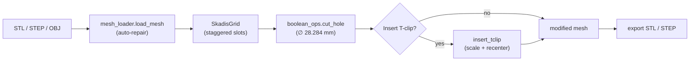

# Skadis T-Clip Adder


> Add IKEA Skadis pegboard T-clip mounting slots to any 3D-printable model — so a printed tool holder snaps onto a Skadis board without redesigning the part.

Most tool-holder models on Thingiverse are solid: no holes, no mounting. This tool loads an STL/STEP/OBJ part, overlays the real staggered Skadis pegboard grid, and boolean-cuts the rotating T-clip holes (∅ 28.284 mm) exactly where you click. It optionally inserts printable T-clip geometry and exports a ready-to-print mesh. Run it through a tkinter GUI, an interactive CLI, or a one-shot headless demo.

## ✨ Features

- **Three ways to run** — a tkinter GUI (`gui_app.py`), an interactive CLI (`main.py`), and a headless demo (`demo.py`) that runs end-to-end with no input.
- **Loads STL, STEP, and OBJ** via `trimesh` (STEP through the `gmsh` adapter), and auto-repairs non-watertight meshes before cutting.
- **Accurate staggered grid** matching the physical Skadis board: 20 mm horizontal × 40 mm vertical spacing, every other column offset by 20 mm.
- **Pick any face** of the part's bounding box to lay the grid on — click it, or press `F`/`B`/`L`/`R`/`T`/`M` in the GUI (Front/Back/Left/Right/Top/Bottom).
- **Rotating T-clip holes** at ∅ 28.284 mm (√2 × 20 mm), so the printed clip turns 45° to lock into the board with zero hardware.
- **Optional T-clip insertion** — drops printable clip geometry into the cut holes, auto-scaling meter→millimeter units and recentering.
- **Resilient boolean engine** — tries `manifold3d`, then OpenSCAD, then Blender, and degrades gracefully instead of crashing if none are available.
- **Export STL or STEP**, with multi-view 3D preview (isometric / front / top / labelled detail) before you save.

## 📦 Installation

**Prerequisites:** Python 3.8+ with `tkinter`. The official macOS and Windows installers ship `tkinter` already; on Debian/Ubuntu install it separately:

```bash
sudo apt install python3-tk
```

Then install the core dependencies:

```bash
pip install -r requirements.txt
```

Recommended optional dependencies — each unlocks a real capability:

```bash
pip install manifold3d   # fastest, preferred boolean engine
pip install gmsh         # required to import STEP files
pip install pyvista      # richer interactive 3D viewer (falls back to matplotlib)
```

For the OpenSCAD boolean fallback on macOS:

```bash
brew install openscad
```

## 🚀 Usage

### GUI (recommended)

```bash
python gui_app.py
```

A 1400×900 window opens with a scrollable control panel on the left and a 3D preview on the right. The workflow follows the labelled steps:

1. **Load Mesh** — browse to your STL/STEP/OBJ file.
2. **Select Face** — click a colored bounding-box face, or press `F`/`B`/`L`/`R`/`T`/`M`.
3. **Grid Offset** — nudge the grid with the X/Y/Z sliders (±50 mm).
4. **Select Slots** — click grid points; selected slots change color.
5. **Cutting Depth** — set depth, 1–50 mm (default 10 mm).
6. **Process** — cut holes and insert T-clips, then **Export** as STL or STEP.

### CLI

```bash
python main.py
```

Follow the prompts. Slots are selected by number with commas and ranges:

```
Single slot:    12
Multiple slots: 5,12,18
Range:          5-8
Mixed:          5,12-15,20
```

Example session (abbreviated):

```
$ python main.py
Found: Clip Seat.step
Use this file? [y]: y
...
Slot number(s): 5,12
Enter depth in mm [10.0]: 12
✓ Processing complete!
Output filename [Clip_Seat_with_tclip.stl]:
✓ Successfully exported: Clip_Seat_with_tclip.stl
```

### Headless demo

```bash
python demo.py
```

Loads the bundled `Clip Seat.step`, builds a centered grid, auto-selects the three middle slots, cuts 10 mm holes, and writes `Clip_Seat_with_tclip_demo.stl`. Use it to verify your environment is working.

### Python API

```python
from core.mesh_loader import load_mesh
from core.grid_system import SkadisGrid
from core.boolean_ops import process_multiple_slots

mesh = load_mesh("your_part.stl")
grid = SkadisGrid(mesh, offset=(0, 0, 0), use_mesh_center=True)

slot_positions = [grid.get_slot_position(i) for i in [5, 12, 18]]
result = process_multiple_slots(mesh, slot_positions, depths=10.0)

result.export("output.stl")
```

## ⚙️ Configuration

All physical constants live in [`config.py`](config.py). Edit them directly — there is no config file.

| Constant | Default | Meaning |
| --- | --- | --- |
| `SKADIS_SLOT_SPACING_H` | `20.0` mm | Horizontal center-to-center slot spacing |
| `SKADIS_SLOT_SPACING_V` | `40.0` mm | Vertical center-to-center slot spacing |
| `SKADIS_STAGGER_OFFSET` | `20.0` mm | Vertical shift applied to every other column |
| `T_CLIP_CIRCLE_DIAMETER` | `28.284` mm | Hole diameter (√2 × 20 mm, for 45° rotation) |
| `T_CLIP_DEFAULT_DEPTH` | `10.0` mm | Default cutting depth |
| `SKADIS_BOARD_THICKNESS` | `5.0` mm | Reference board thickness |

Visualization colors (`MESH_COLOR`, `GRID_COLOR`, and the per-face `BBOX_COLORS` map) are in the same file.

## 🧱 How it works

Everything flows through a single `trimesh.Trimesh` object — loaded, gridded, cut, and exported.



**Boolean engine fallback.** `cut_hole()` tries engines in order — `manifold3d` → OpenSCAD (`scad`) → Blender. If all fail, it returns the original mesh unchanged rather than raising, so a missing engine never blocks the whole run.

**The rotating T-clip.** The hole diameter is √2 × 20 mm = 28.284 mm: a printed clip sized to the 20 mm slot pitches passes through the hole when aligned, then rotates 45° to lock behind the board — a fully printable, hardware-free mount.

## 🤝 Contributing

No formal test suite is configured. `python test_load.py` is a sanity check that verifies imports and STEP loading. Keep changes consistent with the existing patterns in [`AGENTS.md`](AGENTS.md): `trimesh` un-aliased, `numpy` as `np`, flat constants in `config.py`, and graceful per-engine fallback in boolean operations.

## 📄 License

This repository does **not** currently include a `LICENSE` file, so no open-source license is granted by default and standard copyright ("All rights reserved") applies to the code as committed. Add a `LICENSE` file (e.g. MIT) to declare terms.
